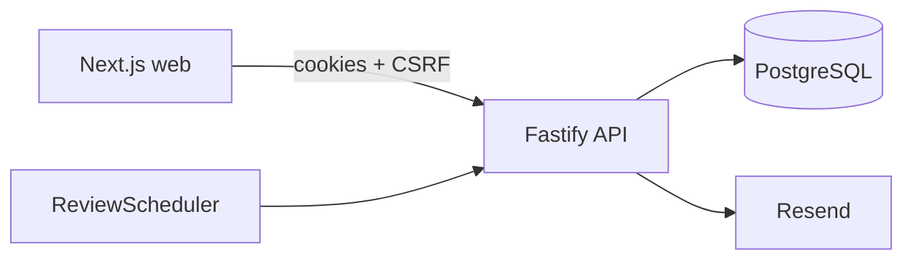

# Impact Plan API

Backend for **Dev-Afrique Impact Plan** — invite-only annual goal-setting and year-end review.

## Stack

- Node 20 + TypeScript (strict)
- Fastify + Zod
- PostgreSQL + Prisma
- Argon2id sessions (httpOnly cookies) + CSRF double-submit
- Resend (transactional email)
- Vitest + Supertest
- Docker Compose for Postgres
- GitHub Actions (lint, typecheck, test, build)

## Architecture



Layers: `routes → services → repositories/Prisma` with pure domain logic in `src/domain/` (scoring, lifecycle, OTP, passwords).

## Quickstart

```bash
cp .env.example .env
# Optional: set RESEND_API_KEY (without it, emails log to the console)
docker compose up -d   # if Docker is available
pnpm install
pnpm db:generate
pnpm db:migrate:deploy
pnpm db:seed
pnpm dev
```

- API: http://localhost:4000
- Swagger: http://localhost:4000/docs

### Seed accounts

| Email                    | Password      | Notes                  |
| ------------------------ | ------------- | ---------------------- |
| `admin@devafrique.com`   | `AdminPass1!` | Admin                  |
| `t.bello@devafrique.com` | `StaffPass1!` | Locked 2026 plan       |
| `a.obi@devafrique.com`   | OTP           | In-review plan (Amaka) |
| `n.eze@devafrique.com`   | `StaffPass1!` | Line manager           |

## Env vars

| Variable                              | Purpose                                                                |
| ------------------------------------- | ---------------------------------------------------------------------- |
| `DATABASE_URL`                        | Postgres connection                                                    |
| `SESSION_SECRET`                      | ≥32 chars cookie secret                                                |
| `APP_URL` / `API_URL` / `CORS_ORIGIN` | Web/API origins                                                        |
| `RESEND_API_KEY`                      | Resend API key (omit in local/dev to log emails instead)               |
| `EMAIL_FROM`                          | From address (must be a verified Resend domain/sender)                 |
| `OTP_RESEND_COOLDOWN_SECONDS`         | Default `60`                                                           |
| `EXPOSE_DEV_SECRETS`                  | Returns invite tokens / OTP `devCode` in API responses (never in prod) |

## Scripts

`pnpm dev` · `pnpm build` · `pnpm lint` · `pnpm typecheck` · `pnpm test` · `pnpm db:*` · `pnpm create-admin` · `pnpm openapi:export`

### Production admin

Do **not** run the demo seed in production. After migrate:

```bash
pnpm create-admin --email you@org.com --password 'YourPass1!' --name 'Ada Okonkwo'
```

Then sign in at `/sign-in` → `POST /v1/auth/login` → redirected to `/admin` when `user.role === "ADMIN"`.

Product API routes are versioned under `/v1` (e.g. `/v1/auth/login`, `/v1/admin/plans`).  
`/api/v1/*` is also accepted as an alias (same handlers) for clients that keep the web proxy prefix.  
`GET /health`, `/docs`, and `/openapi.json` stay unversioned.

## Plan lifecycle

`DRAFT → LOCKED ⇄ UNLOCKED/PARTLY_UNLOCKED → REVIEW_OPEN → IN_REVIEW → FINALIZED`

## Scoring

- Component score = mean of PM entry scores
- Points = score × weight/100
- Final = Σ points (display rounded to 1 decimal)
- Verified: `87.5×40% + 60×10% + 80×30% + 65×20% = 78.0`

## Permissions

| Actor        | Can                                                 |
| ------------ | --------------------------------------------------- |
| Owner        | View own plan, request edits, self-assess when open |
| Tagged PM    | Score own tagged entries after submit               |
| Line manager | Review/finalize direct reports                      |
| Admin        | Users, plans, unlock/relock, review cycle           |

## Testing & CI

Unit tests cover scoring, lifecycle, passwords, OTP. GitHub Actions runs lint/typecheck/test/build on push/PR.

## Deployment notes

- Node 20+
- Build: `pnpm install --frozen-lockfile && pnpm build`
- Release migrate: `pnpm db:migrate:deploy`
- Start: `pnpm start` (listens on `HOST`/`PORT`, health at `GET /health`)
- Set `COOKIE_SECURE=true` behind HTTPS
- Set `EXPOSE_DEV_SECRETS=false`
- Create the first admin with `pnpm create-admin` (see above)
- Set `APP_URL` / `CORS_ORIGIN` to the public web origin; `API_URL` to the public API origin
- Set `RESEND_API_KEY` + a verified `EMAIL_FROM` (without Resend, emails only log)
- Schedule daily (as an admin session + CSRF): `POST /v1/admin/jobs/run-daily`

### Render

| Setting       | Value                                          |
| ------------- | ---------------------------------------------- |
| Build Command | `pnpm install --frozen-lockfile && pnpm build` |
| Start Command | `pnpm start:prod`                              |

`postinstall` and `build` both run `prisma generate`. If Render only runs `tsc` / `typecheck`, you get `PrismaClient` missing and a cascade of implicit-`any` errors.
