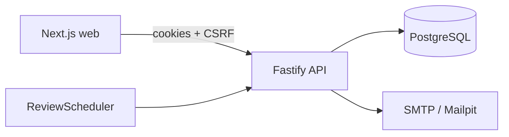

# Impact Plan API

Backend for **Dev-Afrique Impact Plan** — invite-only annual goal-setting and year-end review.

## Stack

- Node 20 + TypeScript (strict)
- Fastify + Zod
- PostgreSQL + Prisma
- Argon2id sessions (httpOnly cookies) + CSRF double-submit
- Nodemailer (SMTP / Mailpit locally)
- Vitest + Supertest
- Docker Compose for Postgres + Mailpit
- GitHub Actions (lint, typecheck, test, build)

## Architecture



Layers: `routes → services → repositories/Prisma` with pure domain logic in `src/domain/` (scoring, lifecycle, OTP, passwords).

## Quickstart

```bash
cp .env.example .env
# Start Postgres + Mailpit (Docker) OR point DATABASE_URL at local Postgres
docker compose up -d   # if Docker is available
pnpm install
pnpm db:generate
pnpm db:migrate:deploy
pnpm db:seed
pnpm dev
```

- API: http://localhost:4000
- Swagger: http://localhost:4000/docs
- Mailpit UI: http://localhost:8025

### Seed accounts

| Email                    | Password      | Notes                  |
| ------------------------ | ------------- | ---------------------- |
| `admin@devafrique.com`   | `AdminPass1!` | Admin                  |
| `t.bello@devafrique.com` | `StaffPass1!` | Locked 2026 plan       |
| `a.obi@devafrique.com`   | OTP           | In-review plan (Amaka) |
| `n.eze@devafrique.com`   | `StaffPass1!` | Line manager           |

## Env vars

| Variable                              | Purpose                                         |
| ------------------------------------- | ----------------------------------------------- |
| `DATABASE_URL`                        | Postgres connection                             |
| `SESSION_SECRET`                      | ≥32 chars cookie secret                         |
| `APP_URL` / `API_URL` / `CORS_ORIGIN` | Web/API origins                                 |
| `SMTP_*`                              | Mail transport                                  |
| `OTP_RESEND_COOLDOWN_SECONDS`         | Default `60`                                    |
| `DEV_SHORTCUTS`                       | Enables `/auth/dev/login-admin` (never in prod) |

## Scripts

`pnpm dev` · `pnpm build` · `pnpm lint` · `pnpm typecheck` · `pnpm test` · `pnpm db:*` · `pnpm openapi:export`

## Plan lifecycle

`DRAFT → LOCKED ⇄ UNLOCKED/PARTLY_UNLOCKED → REVIEW_OPEN → IN_REVIEW → FINALIZED`

## Scoring

- Component score = mean of PM entry scores
- Points = score × weight/100
- Final = Σ points (display rounded to 1 decimal)
- Verified: `87.5×40% + 60×10% + 80×30% + 65×20% = 78.0`

## Permissions

| Actor        | Can                                                 |
| ------------ | --------------------------------------------------- |
| Owner        | View own plan, request edits, self-assess when open |
| Tagged PM    | Score own tagged entries after submit               |
| Line manager | Review/finalize direct reports                      |
| Admin        | Users, plans, unlock/relock, review cycle           |

## Testing & CI

Unit tests cover scoring, lifecycle, passwords, OTP. GitHub Actions runs lint/typecheck/test/build on push/PR.

## Deployment notes

- Set `COOKIE_SECURE=true` behind HTTPS
- Disable `DEV_SHORTCUTS`
- Run `pnpm db:migrate:deploy` on release
- Schedule `POST /admin/jobs/run-daily` (or call `ReviewScheduler.runDaily`) once per day
